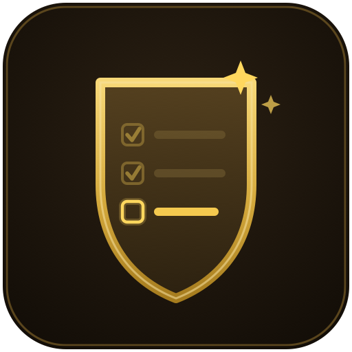

  

# Remaining Achievements

A World of Warcraft (retail) addon that adds a **"Remaining"** tab to the default Achievement UI (`Y`), showing one flat, scrollable list of **every achievement you haven't completed yet** — across all categories, no more clicking through them one by one.

## Features

- **One list, all categories** — every incomplete achievement in a single native-looking list, using Blizzard's own achievement rows: icon, points shield, tooltip, click to expand objectives, shift-click to link in chat. Progressive chains show their later steps too, not just the current one.
- **Search** — filter the list by name or description text.
- **Stash for later** — click the X on a row (or right-click) to set aside achievements you're never going to do. A "Show stashed for later (N)" toggle reveals them again with one-click restore, and everything persists account-wide.
- **Hidden achievements** *(beta)* — a toggle surfaces the point-carrying achievements Blizzard hides from the UI until they're earned.
- **Feats of Strength — obtainable only** *(beta)* — a toggle shows the feats you can still actually earn, current season included; retired promotions, old seasonal rewards, realm firsts, and dead one-time events are filtered out.
- **Opposite faction** *(beta)* — log a character of your other faction and open the tab once; after that, a toggle shows the achievements only that faction can still earn, tagged (Horde)/(Alliance), with combined "(+N Horde)" totals in the header. Built for DataForAzeroth-style completionists.
- **Spreadsheet export** — one click builds a tab-separated table (ID, name, category, points, description, reward, Wowhead link, stashed/hidden/faction flags). Copy it and paste directly into Google Sheets or Excel — it lands as proper columns, no file or import step needed.
- **Right-click menu** on any row: stash/restore, track on the objectives HUD, link to chat.
- **Plays nice with ElvUI** — the tab picks up your skin.

## Install

- **CurseForge:** install "Remaining Achievements" via the CurseForge app.
- **Manual:** download and unzip into `World of Warcraft/_retail_/Interface/AddOns/RemainingAchievements/`.

## Notes

- "Remaining" means not yet completed by anyone on your account (the same account-wide semantic the default UI uses).
- Beta toggles are filtered from game data that doesn't track obtainability — if something unobtainable slips through (or something real is missing), please report it.
- Guild achievements and Classic are out of scope for now.

## License

MIT — see [LICENSE](LICENSE).
